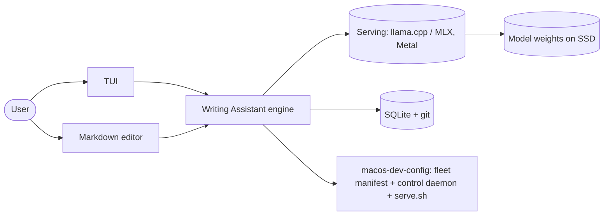
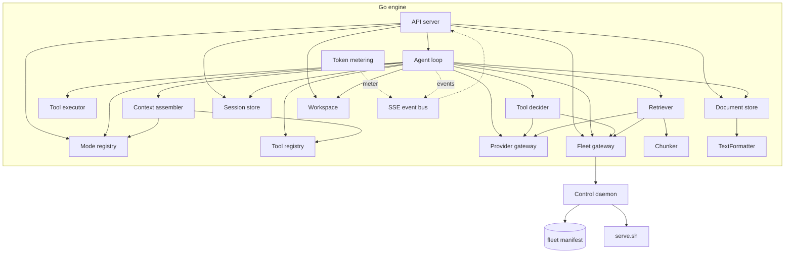
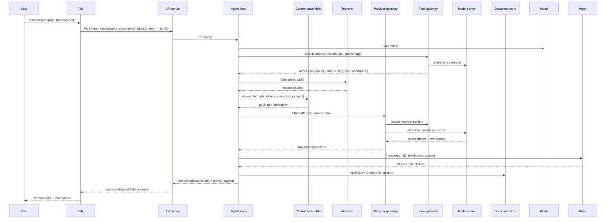
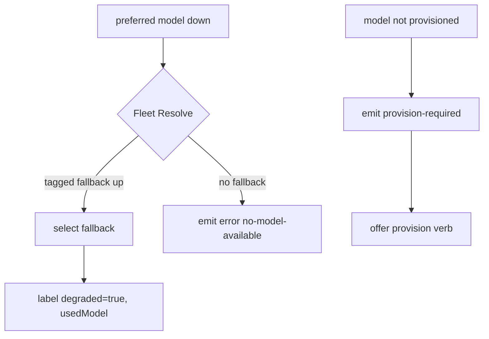
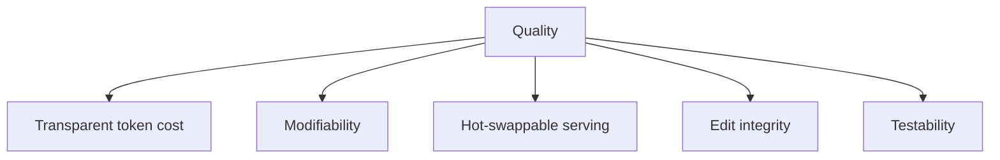

# Academic Writing Assistant — Architecture (arc42)

arc42 skeleton, 12 sections. Related: [ADR log](adr/), [behavioral contracts](behaviors/), [precise contracts](contracts/), [traceability](traceability.md).

---

## 1. Introduction & Goals

### 1.1 Requirements overview

A local-first, single-machine assistant for academic writing and editing. You
drive it from a terminal TUI today and a richer markdown editor later; it reasons
over your own notes and ingested literature, edits markdown in place, and makes
every token that goes into a model call visible. It is **not** an inference
engine (that's delegated) and **not** a full IDE. One user governs it, and that
user also controls — from `macos-dev-config` — **which models are served on the
machine**.

### 1.2 Quality goals (top 5)

Ranked; each has a measurable, Gherkin-style scenario and links to its ADR.

| # | Goal | Scenario (Gherkin-style) | Linked |
|---|---|---|---|
| Q1 | **Transparent token cost** | Given any turn, when the engine assembles the payload, then a per-component breakdown is reported and every lever change is visible in the meter | ADR-0011 |
| Q2 | **Modifiability** | Given a new model or mode, when the manifest/mode data is edited, then behavior changes with no engine rebuild | ADR-0006, ADR-0009 |
| Q3 | **Hot-swappable serving** | Given a preferred model is down, when a turn runs, then a tagged fallback serves it and the substitution is labeled | ADR-0005, ADR-0015 |
| Q4 | **Edit integrity** | Given any accepted edit, when it is committed, then it is versioned in git and revertible at word-level granularity | ADR-0004 |
| Q5 | **Testability** | Given any module, when exercised through its public API, then it can be verified in isolation against a stubbed endpoint | ADR-0001 |

### 1.3 Stakeholders

| Stakeholder | Expectations |
|---|---|
| Primary user (the operator/author) | control served models from macos-dev-config; see token cost; swap frontends without rework |
| Future machine (GPU box) | consume the archived full-precision models; re-run the fleet policy (ADR-0015) |
| Remote machine | reach serving over the control daemon without replicating the local runner setup (ADR-0025) |
| Client authors (TUI/Tauri) | a stable, codegen'd OpenAPI contract to build against |

## 2. Constraints

| Constraint | Source |
|---|---|
| Follows the base model: compact modules, sealed by default, cross-module access only via defined public APIs; deviation requires an ADR | Framework (ADR-0001) |
| Local-first, single machine; privacy preserved (no public hosting requirement) | architecture.md |
| No Node/Python at runtime for the engine; single static Go binary (no CGO) | ADR-0003 |
| Mac mini M4, 32 GB unified memory, 120 GB/s bandwidth | hardware |
| Model serving is external over REST (llama.cpp / MLX-LM / MLX-VLM) | ADR-0005, ADR-0030 |
| Local runners use the Metal GPU backend; no CPU-only or CUDA path | ADR-0030 |
| The model fleet is defined in `macos-dev-config`, not in the engine repo | ADR-0006 |

## 3. Context & Scope

### 3.1 System context (C4 L1)



### 3.2 External interfaces

| Interface | Protocol | Notes |
|---|---|---|
| Model serving | OpenAI-compatible REST + SSE | Layer 0; reached via the Provider gateway (ADR-0005, ADR-0016) |
| Fleet manifest | file (JSON) + JSON Schema + semantic lanes validator | two-tier, in macos-dev-config, read only by the daemon (ADR-0018) |
| Serving lifecycle | the control daemon's HTTP verb contract | `serve.sh` wrapped by the daemon (ADR-0007, ADR-0025) |
| Model downloads | HF API (`huggingface-cli`) | provisioning (ADR-0008) |
| Clients | REST + SSE (the OpenAPI contract) | codegen: ogen (Go) · Hey API + Zod (TS) · openapi-to-rust (Rust) (ADR-0017) |

## 4. Solution Strategy

The architecture's defining moves:

1. **Clients are dumb; one engine owns everything.** All logic and state in the
   Go engine; clients are generated from a single OpenAPI spec (ADR-0002, 0003,
   0017).
2. **The fleet manifest is the control panel.** What models are servable is
   *data* in macos-dev-config, read **only** by the control daemon, which the
   engine's Fleet gateway talks to over HTTP (ADR-0018, 0025).
3. **Serving control is a verb contract, transported by a daemon.** Lifecycle
   (`list/start/stop/status/log/reach/provision`) is a defined, idempotent
   contract (ADR-0007), served over HTTP by a daemon wrapping `serve.sh`
   (ADR-0025).
4. **One metered choke point.** The context assembler produces the payload *and*
   its per-component token attribution; the Meter scales that onto
   provider-reported totals (ADR-0011, 0016).
5. **Storage split by concern.** Per-service SQLite files for metadata/search/
   embeddings/history; git for versioning; the `Retriever` behind an interface
   (ADR-0004, 0020).

## 5. Building Block View

### 5.1 Container view (C4 L2)

```mermaid
flowchart TB
    subgraph clients[Clients]
        TUI[TUI — OpenTUI/Solid]
        Tauri[Tauri editor — Rust + Vue + CM6]
    end
    Engine[Go engine — single daemon]:::engine
    subgraph serving[Serving — macos-dev-config]
        Manifest[(fleet manifest)]
        Daemon[Control daemon]
        Exec[serve.sh executor]
        Runners[llama.cpp / MLX (Metal)]
    end
    subgraph store[Storage]
        SQLite[(SQLite: per-service files)]
        Git[(git repo)]
    end
    TUI -->|REST+SSE| Engine
    Tauri -->|REST+SSE| Engine
    Engine -->|OpenAI REST| Runners
    Engine -->|lifecycle verbs| Daemon
    Daemon -->|read| Manifest
    Daemon -->|wrap| Exec
    Exec --> Runners
    Engine --> SQLite
    Engine --> Git
    classDef engine fill:#e8f0fe,stroke:#4a7
```

### 5.2 Component view (C4 L3)



| Component | Responsibility | Public API | Hidden internals |
|---|---|---|---|
| Fleet gateway | model discovery, resolution (merge + gates + fallback), lifecycle | `ListModels`, `Resolve(name, opts) → Resolution`, `Status`, `Start` (blocking), `Stop`, `Provision` (async), `Fingerprint` (router sync gate) | daemon HTTP client, fallback ladder |
| Provider gateway | OpenAI-compatible REST/SSE calls | `Chat(ctx, target, params)`, `Stream(ctx, target, params, emit)`, `Embed(ctx, target, text)` | retry/backoff, `-np 1` serialization |
| Agent loop | turn loop (thin orchestrator, session-scoped) | `Run(ctx, task) → (turnID, err)` (async) | turn state machine, dispatch/observe |
| Mode registry | modes as data | `List`, `Get` | validation, file loading |
| Tool registry | tool definitions + schemas | `Register`, `List`, `AllowlistFor` | schema validation |
| Tool executor | tool execution | `Invoke(name, args)` | name-keyed handler map |
| Tool decider (optional) | tool-intent resolution ("which tool, what args") from a writer's `request_tool` intent | `SignalTool`, `Decide(ctx, intent, c)` | prompt layout, Provider.Chat, τ threshold, `.cact` fingerprint |
| Context assembler | payload + attribution (pure) | `Assemble(ctx, in) → (Payload, Breakdown)` | layout, truncation, accounting |
| Token metering | counts + attribution + persistence | `Attribute(ctx, turnID, breakdown, counts)` | scale-to-total, `meter.db` |
| Retriever | retrieval | `Query(ctx, text, topK)`, `Index(ctx, docID)` | embedding, sqlite-vec KNN, FTS5 |
| Chunker | chunking (pure) | `Chunk(tree []Block, maxTokens int)` | splitting algorithm |
| TextFormatter | formatting (pure) | `Normalize(kind, text)`, `Validate(kind, text)`, `Format(kind, text)` | hardcoded opinionated style |
| Document store | document + versions | `Open`, `Save`, `Blocks`, `ApplyEdit`, `Commit`, `Diff`, `History`, `Candidates` | git, block UUIDs, candidate side-table |
| Workspace (leaf) | read-only filesystem reach: directory listing + bounded raw reads | `List(ctx, dir) → []Entry`, `Read(ctx, path, maxBytes)` | `os.ReadDir`/`os.ReadFile`, path validation, byte caps |
| Session store | sessions + their messages (one per selection/doc) | `ListByDocument`, `Create`, `Resume`, `Append`, `History` | `sessions.db` |
| API server | REST/SSE surface (codegen'd) | routes per OpenAPI spec | framing, turnID↔session↔client correlation |
| SSE event bus | typed event fan-out | `Emit`, `Subscribe` | connection registry, backpressure |

The full module list, precise signatures, and the acyclic dependency graph are
specified in `contracts/module-boundaries.md`. Internal boundaries are **sealed Go
interfaces over pure DTOs** (the locked-service tenet, ADR-0016) — no module
reaches another's types, tables, state, or files, and REST/HTTP exists only at
process boundaries.

### 5.3 Code level (C4 L4)

Deferred — generated from source as it lands. Pre-defined seams/interfaces:
`FleetGateway`, `ProviderGateway`, `Retriever`, `ContextAssembler`,
`Chunker`, `TokenMeter`, `DocumentStore`, `SessionStore`, `EventBus`,
`ToolDecider` (optional, ADR-0028), `TextFormatter` (ADR-0029)
(see `contracts/interface.md`).

## 6. Runtime View

### 6.1 Happy path



### 6.2 Failure / degradation path



## 7. Deployment View

```mermaid
flowchart TB
    subgraph mac[Mac mini M4 / 32GB]
        Engine[Go engine: daemon or Tauri sidecar]
        subgraph desktop[Desktop]
            Tauri[Tauri app + sidecar engine]
        end
        subgraph web[Web]
            UI[Vue+CodeMirror served]
        end
        TUI[TUI]
        subgraph serving[Serving]
            Manifest[(fleet manifest)]
            Exec[serve.sh]
            Runners[llama.cpp / MLX (Metal) on local ports]
        end
        SSD[(Ex-SSD: models/ + caches/)]
    end
    Runners --> SSD
    Engine -->|REST| Runners
```

- Desktop (Tauri): Go engine bundled as a sidecar, spawned by the Rust core.
- Web: same UI served locally; engine self-hosted on the machine/LAN.
- TUI: OpenTUI terminal client, same contract.

## 8. Cross-cutting Concepts

| Concept | Approach |
|---|---|
| Module sealing / public APIs | sealed Go interfaces over **pure DTOs** (locked-service tenet); no REST between modules — `contracts/module-boundaries.md` (ADR-0001, ADR-0016) |
| Fleet manifest (control panel) | two-tier JSON (daemons + models) in macos-dev-config, JSON-Schema + semantic lanes validator — `contracts/data-model.md` §2 (ADR-0018) |
| Serving lifecycle | idempotent verb contract, transported by an HTTP **control daemon** wrapping `serve.sh` — `contracts/interface.md` §12 (ADR-0007, ADR-0025) |
| Provisioning | HF API download + lanes rule; async + observable — ADR-0008, ADR-0018 |
| Token metering | assembler accounting scaled onto provider totals by the Meter; thinking approximated when omitted — ADR-0011, ADR-0016, ADR-0024 |
| Streaming | SSE typed events + NDJSON fallback; events turnID-correlated — ADR-0012, ADR-0017 |
| Versioning | git (coarse, commit-per-AI-edit + autosave) + stable UUID block IDs (fine) + candidate side-table — ADR-0004, ADR-0020 |
| Fleet policy | MoE over dense, 14B+ citation floor, temperature sheet — ADR-0015 |
| Tool routing | optional `ToolDecider`: writer emits `request_tool`, specialist resolves tool+args; per-mode `toolCalling` toggle; fail-fast sync gate — ADR-0028 |
| Edit formatting | the engine owns the bytes: whole-block edits, `TextFormatter` normalize/validate/format, block-level guard, structured edit result — ADR-0029 |
| Workspace navigation | engine-served shallow directory listing (Workspace leaf) + turn-scoped, metered `@`-mentions that are read-only context, never versioned documents — ADR-0035, ADR-0036 |
| Inference control surface | a future `InferenceControl` interface *behind* the Provider seam (a sibling of `ProviderGateway`, not a change to it); the "knobs" (logprobs, grammar, KV, speculative decoding) are decoupled from the OpenAI-compatible contract for the MVP — `research/vision-native-local-llm-text-editing.md` |
| Deployment/security | sidecar spawn dynamic-port-default; localhost bind; Tailscale deny-by-default — ADR-0021 |

## 9. Architectural Decisions

Full records in [adr/](adr/). Index:

| # | Decision | Status |
|---|---|---|
| 0001 | Base model: compact modules + explicit public APIs | Accepted |
| 0002 | Layered, REST-first process architecture; dumb clients | Accepted |
| 0003 | Single Go engine binary + contract-first codegen | Partially superseded by 0017 (codegen tool selection) |
| 0004 | SQLite (meta/vec/FTS) + git versioning; Retriever interface | Accepted |
| 0005 | Provider gateway: name → endpoint + capabilities | Superseded by 0016 |
| 0006 | Fleet manifest (JSON) in macos-dev-config as source of truth | Superseded by 0018 |
| 0007 | Serving lifecycle verbs as a defined control contract | Partially superseded by 0025 (the "no HTTP daemon" conclusion); verb contract unchanged |
| 0008 | Model provisioning via HF API | Partially superseded by 0030 (source kinds narrowed) |
| 0009 | Mode registry: modes as data | Superseded by 0019 |
| 0010 | Tool registry: tools as data with JSON schemas | Superseded by 0016/0019 |
| 0011 | Context assembler: single metered choke point | Superseded by 0016 (scale-to-total), 0022 (measurable target), 0024 (thinking tokenizer) |
| 0012 | SSE typed events + NDJSON fallback | Accepted |
| 0013 | Clients: OpenTUI first, Tauri later, both dumb | Partially superseded by 0023 (OpenTUI renderer only) |
| 0014 | Deployment targets + capability adapter | Partially superseded by 0021 (sidecar spawn mechanics only) |
| 0015 | Fleet sizing policy (MoE, 14B+ floor, temperature) | Accepted |
| 0016 | Module inventory + exact public APIs, pure-DTO boundaries | Accepted |
| 0017 | OpenAPI contract surface: endpoints, SSE, codegen (ogen/Zod/openapi-to-rust) | Accepted |
| 0018 | Fleet manifest: two-tier + serve.sh migration + lanes + async provision | Partially superseded by 0030 (runner enum narrowed) |
| 0019 | Modes/tools as data: engine-repo, fail-fast, name-keyed handler bind | Accepted |
| 0020 | Storage: commit cadence, worktree, UUID blocks, candidates, Chunker | Accepted |
| 0021 | Deployment + security: sidecar spawn, bind policy, Tailscale-only | Accepted |
| 0022 | Quality goals as measurable SEI scenarios | Accepted |
| 0023 | OpenTUI renderer: Solid | Accepted |
| 0024 | Thinking-token attribution: bundled tokenizer fallback | Accepted |
| 0025 | Serving control transport: HTTP control daemon wrapping serve.sh | Accepted |
| 0026 | Sessions as first-class entities (session store, per-session concurrency, budget) | Accepted |
| 0027 | Locked-service tenet: shared-DTO ownership + stream seams; daemon sole manifest reader | Accepted |
| 0028 | Tool decider: optional router ("writer signals, specialist decides") | Accepted |
| 0029 | Edit verification + TextFormatter: "the engine owns the bytes" | Accepted |
| 0030 | Fleet substrate: pure llama.cpp + MLX on Metal | Accepted |
| 0031 | SSE server transport is hand-framed; ogen scope clarified | Accepted |
| 0032 | Control daemon authored in texteditor; lifecycle decision-gaps closed | Accepted |
| 0033 | Control daemon source moved to macos-dev-config (the machine-local LLM control plane) | Accepted |
| 0034 | Repository layout: client/server split, contract at root | Accepted |
| 0035 | Directory listing: engine-served Workspace capability | Accepted |
| 0036 | File mentions: metered, turn-scoped context attachments | Accepted |

## 10. Quality Requirements

### 10.1 Quality tree



### 10.2 Quality scenarios

Each is an SEI general scenario with a concrete response-measure (ADR-0022).

| # | Scenario | Response-measure |
|---|---|---|
| Q1 | Given any turn, the per-component token breakdown is reported and lever changes are visible (ADR-0011/0016) | breakdown ≤100 ms after usage lands; scaled sum equals provider total exactly; overflow labeled |
| Q2 | Given a model/mode edit in data, behavior changes with no rebuild (ADR-0018/0019) | next-turn effect, 0 rebuilds; startup validate ≤50 ms |
| Q3 | Given a down model, a tagged fallback serves and is labeled (ADR-0015/0016) | fallback ≤60 s cold; degradation label guaranteed |
| Q4 | Given an accepted edit, it is git-versioned and word-level revertible (ADR-0020) | diff ≤100 ms; revert isolates blocks |
| Q5 | Given any module, it is verifiable in isolation through its public API (ADR-0001/0016) | 100% of public ops stub-tested |

### 10.2b Functional behavior contracts

| Feature file | Concern | Source ADRs |
|---|---|---|
| serving-control.feature | manifest + verbs + provisioning | 0006, 0007, 0008, 0018, 0025 |
| provider-hotswap.feature | fallback + citation floor | 0005, 0009, 0015, 0016, 0019 |
| token-metering.feature | per-component attribution | 0011, 0016, 0022, 0024 |
| versioning.feature | git + block IDs | 0004, 0020 |
| client-swap.feature | dumb generated clients | 0002, 0013, 0016, 0017, 0023 |
| sessions.feature | persisted sessions, per-session concurrency + budget | 0026 |
| tool-routing.feature | writer-signals-router-decides, per-mode toggle, fail-fast gates | 0028 |
| edit-integrity.feature | whole-block edits, engine-owned formatting, block-level guard, structured result | 0029 |
| workspace.feature | engine-served directory listing, `@`-mentions as metered read-only context | 0035, 0036 |

### 10.3 Definition of done (documentation)

The documentation set is complete when:

- No `TBD` / placeholder text remains anywhere.
- Every ADR appears in the §9 index (0001 = base model: affirmed or deviated).
- Every module has a documented public API in `contracts/module-boundaries.md` (base model).
- Every §10.2 quality scenario links a Gherkin behavior contract (see traceability.md).
- Cross-cutting mechanisms have a precise contract in `contracts/` and are linked from §8.
- ADR decisions are traceable to arc42 sections, behaviors, and contracts (traceability.md).

## 11. Risks & Technical Debt

| # | Risk | Severity | Mitigation |
|---|---|---|---|
| 1 | Control-daemon boundary is a process-boundary coupling (was `serve.sh` shell-out) | Low | resolved — ADR-0025 wraps `serve.sh` behind the daemon's HTTP contract; the verb contract is the invariant |
| 2 | Attribution of tokens across components is approximate (provider totals) | Medium | assembler accounting scaled onto exact totals; thinking/labeled overline when omitted (ADR-0016, ADR-0024) |
| 3 | `modernc.org/sqlite` slower than CGO for heavy writes | Low | single-user local workload; revisit if write volume grows |
| 4 | Fleet policy is hardware-specific | Medium | re-run ADR-0015 on hardware change; archive preserves models |
| 5 | No auth on local inference servers exposed to LAN | Low | Tailscale ACL deny-by-default + pre-bind gate (ADR-0021) |
| 6 | Bundled per-family tokenizer (thinking fallback) adds binary size + maintenance | Low | scoped to reasoning-prefix counting, omitting-providers only (ADR-0024) |
| 7 | The `.cact` router artifact can drift from the tool vocabulary | Medium | `router-tools-stale` startup sync gate (ADR-0028); re-`needle finetune` or switch the mode back to `native` |
| 8 | Hardcoded formatter style may diverge from model expectations | Low | the style is fixed code, so the model trains against a stable target (ADR-0029); `Validate` catches structural drift |
| 9 | Inference control surface (knobs) deferred | Low | decoupling model: `InferenceControl` is a future *sibling* interface behind the Provider seam, not a Provider change (vision doc); the non-native knobs (logprobs, grammar, logit-bias) arrive via a richer protocol, the native knobs (KV branching, speculative decoding) stay deferred pending in-process; do not bake OpenAI-only assumptions into the loop or assembler |

## 12. Glossary

| Term | Definition |
|---|---|
| Fleet manifest | `models.json` in macos-dev-config; two-tier (daemons + models) declaration of servable models |
| Fleet gateway | engine module that discovers/resolves models and drives lifecycle via the daemon |
| Control daemon | HTTP transport over the lifecycle verb contract; the sole `models.json` reader (wraps `serve.sh`) |
| Lifecycle verbs | the `list/start/stop/status/log/reach/provision` control contract |
| Lane | a model's single assigned runner/daemon (one daemon per model's `source`) |
| Mode | a declarative persona: prompt + default model + tool set + budget |
| Choke point | the context assembler — the single place where the token payload is built |
| Block ID | stable UUID identifier for a paragraph/heading/table, enabling fine-grained versioning |
| Candidate | an unaccepted AI edit, keyed by block ID in a Document-store side-table |
| Session | a persisted conversation — doc-level or anchored to a block selection; multiple per file, runnable concurrently |
| Pure DTO | a boundary type with no behavior; the only thing that crosses a module seam (locked-service tenet) |
| Provision | fetch model weights via the HF API (async, observable) |

---

## Appendix A: Standards mapping (ISO/IEC/IEEE 42010 + SEI Views & Beyond)

| 42010 concept | Where |
|---|---|
| Concerns | §1.2 quality goals, §10.1 tree |
| Viewpoints | Appendix B (declared below) |
| Views | §5 (structure), §6 (runtime), §7 (deployment) |
| Architecture decisions | §9 + ADR log |
| Rationale | ADR Context/Consequences sections |
| Correspondences | Appendix B mapping table |

| SEI viewtype | Style | This system |
|---|---|---|
| **Module** | layered, decomposition | §5.2 components; packages; hierarchy |
| **Component-and-connector** | communicating-processes, shared-data | §6: runtime elements + connectors |
| **Allocation** | deployment | §7: environment/hardware mapping |

## Appendix B: Viewpoint declaration

| Viewpoint | Audience | Concern | Section |
|---|---|---|---|
| Context | everyone | scope, interfaces | §3 |
| Container | architects | technology choices, boundaries | §5.1 |
| Component | developers | responsibilities, seams | §5.2 |
| Runtime | developers/ops | behavior, failure, degradation | §6 |
| Deployment | platform engineers | environment, constraints | §7 |
| Decision | all future maintainers | why | §9, ADR log |
| Behavior contracts | testers/agents | executable rules | behaviors/ |
