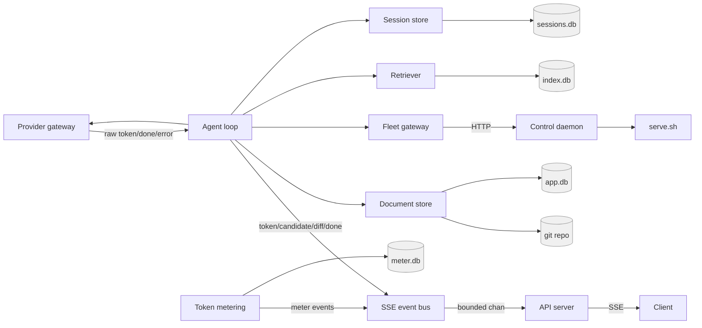

# Concurrency topology contract

The bounded graph: which queue feeds what, capacities, backpressure, and
single-writer serialization. Source ADRs: ADR-0012 (event bus), ADR-0016 (turn
async + turnID correlation), ADR-0020 (storage), ADR-0025 (daemon), ADR-0026
(sessions).

## 1. The graph

Every queue is bounded. Producers block (or drop with a labeled backpressure
event) when a queue is full — never unbounded buffering.

## 2. Queues and capacities

| Queue | Feeds | Capacity | On overflow |
|---|---|---|---|
| `EventBus` per-subscriber chan | API server → client | 256 events | drop oldest + emit `backpressure` event |
| per-session loop dispatch queue | tool calls | 1 in flight per session | single-turn, single-tool-at-a-time *within a session* |
| provider stream | SSE events | unbounded at source, bounded at subscriber | backpressure via `Subscribe` chan |
| daemon request queue | lifecycle verbs | 1 in flight per daemon | serialized (start/stop/provision are serial) |
| document edit queue | ApplyEdit/Commit per document | serialized per `documentID` | edits apply in arrival order; never rejected |

## 3. Backpressure behavior

- A slow client does **not** slow the provider or the engine: the bus drops the
  client's oldest buffered events and emits one `backpressure` event so the UI can
  show "stream dropped."
- Tool dispatch is serial **per session** (one in flight per turn); a second tool
  call waits until the first observes (state-machine §1.2).
- Lifecycle verbs through the daemon are serialized per daemon (one `start`/
  `stop`/`provision` at a time); concurrent verbs queue.

## 4. Concurrency across sessions

- **One turn in flight per session; sessions run turns concurrently** in
  independent goroutines, each with its own loop state and SSE subscription
  (ADR-0026).
- The system is **built to tolerate arbitrary concurrent turns**; the one-turn-
  per-session rule is a default, not a ceiling, so it is load-testable with N
  concurrent sessions.
- The Provider queues to a `-np 1` server, so concurrent sessions sharing a model
  still serialize at the model boundary.

## 5. Single-writer serialization

- Each SQLite file (`app.db`, `index.db`, `meter.db`, `sessions.db`) and the git
  repo are **single-writer**, owned by exactly one service (ADR-0016). No module
  reads/writes another's file.
- **Meter events** are append-only, single-writer (the Token metering module).
- **Provider calls** are serialized per model server: the provider gateway does
  not fan out concurrent chats to the same `-np 1` slot server; it queues them.
- **Document edits are queue-serialized per document.** Two sessions anchored in
  the same document may propose edits concurrently; `ApplyEdit`/`Commit` apply in
  arrival order for a given `documentID` — a second session's edit **waits** and is
  never rejected nor interleaved mid-block (ADR-0026).
- **The manifest** is read solely by the control daemon; the engine's Fleet reads
  and writes serving state only through the daemon's HTTP contract (ADR-0025).

## 6. Invariants

- No unbounded buffer anywhere; every queue has a stated capacity.
- At most one tool call is in flight per agent-loop turn (per session).
- Single-writer stores (SQLite files, git) are never written concurrently.
- Edits to one document are never interleaved; they apply in arrival order across
  sessions (ADR-0026).
- Backpressure propagates to the source only as a *labeled* drop, never silently.
- Per-turn events are correlated by `turnID`; the API server demultiplexes one
  turn's stream to exactly one client connection (ADR-0016).
