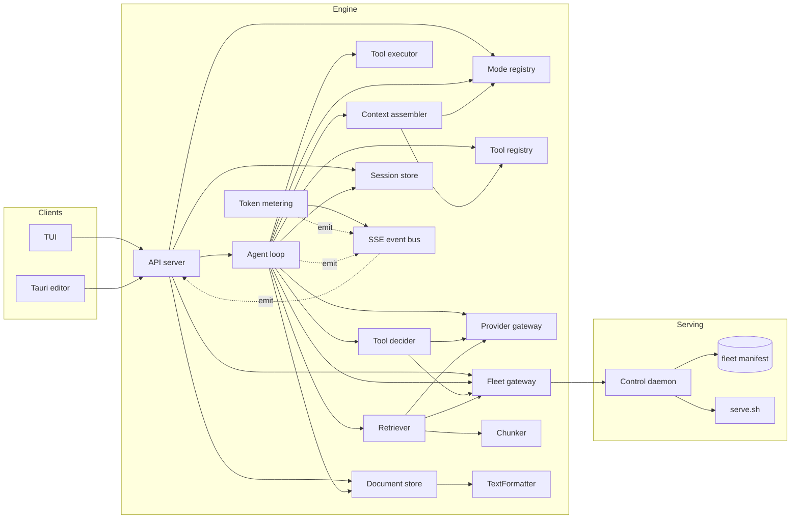

# Module boundaries contract

The per-system record of every module, its public API, and the dependency graph.
Normative per the base model (`ADR-0001`) — sealed-by-default modules exposing
only defined public APIs — hardened by the **locked-service tenet** (ADR-0016):
internal boundaries are sealed Go interfaces over **pure DTOs**, never REST.
REST/HTTP exists only at process boundaries.

Source ADRs: ADR-0001 (base model), ADR-0016 (module inventory + exact APIs),
ADR-0018 (two-tier fleet manifest), ADR-0019 (mode/tool data), ADR-0020 (storage),
ADR-0025 (control daemon), ADR-0026 (sessions).

## 1. Modules

### Engine (Layer 2, Go)

| Module | Owns (concern) | Public API (defined operations) | Hidden internals |
|---|---|---|---|
| **Fleet gateway** | model discovery, resolution (merge + gates + fallback), lifecycle | `ListModels()`, `Resolve(name, opts) → Resolution`, `Status(name) → LiveState`, `Start(name)` (blocking), `Stop(name)`, `Provision(ctx, name) → provisionID` | daemon HTTP client (ADR-0025), verb mapping, fallback ladder |
| **Provider gateway** (leaf) | OpenAI-compatible REST/SSE calls | `Chat(ctx, target, req)`, `Stream(ctx, target, req, emit)`, `Embed(ctx, target, text)` | retry/backoff, per-server `-np 1` serialization, framing |
| **Agent loop** | the turn loop: task → plan → tools → observe → answer | `Run(ctx, task) → (turnID, err)` (async) | turn state machine, dispatch/observe, truncation |
| **Mode registry** (leaf) | declarative modes (persona/model/tools/budget) | `List()`, `Get(name)` | mode file loading (go:embed), validation |
| **Tool registry** (leaf) | tool definitions + JSON schemas | `Register(tool)`, `List()`, `AllowlistFor(mode)` | schema validation, name-keyed binding metadata |
| **Tool executor** | tool execution | `Invoke(name, args) → result` | private `map[name]→handler func` |
| **Tool decider** (optional) | tool-intent resolution ("which tool, what args") from a writer's `request_tool` intent | `SignalTool()`, `Decide(ctx, intent, c) → (RouterResult, error)` | prompt layout, Provider.Chat, confidence threshold τ, `.cact` fingerprint |
| **Context assembler** (leaf) | the exact token payload + per-component attribution | `Assemble(ctx, in) → (Payload, Breakdown)` | prompt layout, budget truncation, attribution accounting |
| **Token metering** | counts + attribution + persistence | `Attribute(ctx, turnID, breakdown, counts) → Attributed` | scale-to-total, `meter.db` writes, thinking-token reconciliation (ADR-0024) |
| **Retriever** | retrieval (semantic + lexical) | `Query(ctx, text, topK) → []Chunk`, `Index(ctx, documentID)` | embedding (via Fleet+Provider), sqlite-vec KNN, FTS5, rerank |
| **Chunker** (leaf) | chunking (paragraph-aligned, size-bounded) | `Chunk(tree []Block, maxTokens int) → ([]Chunk, error)` | splitting algorithm |
| **TextFormatter** (leaf) | formatting: normalize + validate + format block content | `Normalize(kind, text)`, `Validate(kind, text)`, `Format(kind, text)` | hardcoded opinionated style, structural checks |
| **Document store** | document, blocks, version history | `Open`, `Save`, `Blocks`, `ApplyEdit`, `Commit`, `Diff`, `History`, `Candidates` | git (go-git), block-UUID minting, candidate side-table, word-diff |
| **Session store** (leaf) | sessions + their messages | `ListByDocument`, `Create`, `Resume`, `Append`, `History` | `sessions.db` |
| **API server** | the versioned REST/SSE surface (codegen'd) | HTTP routes + SSE endpoints per the OpenAPI spec | framing, validation, turnID↔client correlation |
| **SSE event bus** | typed event fan-out | `Emit(event)`, `Subscribe(filter) → stream` | connection registry, bounded chans |

### Serving (Layer 0, `macos-dev-config`)

| Module | Owns (concern) | Public API (defined operations) | Hidden internals |
|---|---|---|---|
| **Fleet manifest** (data) | what models *can* be served (two-tier: daemons + models) | manifest schema + `Read() → []Model` (validated by the shared loader) | file location, git-ignored local overrides |
| **Control daemon** | HTTP transport over the verb contract; **sole reader of the manifest** | daemon HTTP contract (`list/start/stop/status/log/reach/provision`) | mapping HTTP → `serve.sh`; verb execution; manifest parse + lanes + provision + live state. Authored in `texteditor` at `cmd/fleetdaemon/`, drop-shipped here as a binary (ADR-0032) |
| **Lifecycle executor** (`serve.sh`) | running/stopping model servers (runner logic) | verb contract (invoked by the daemon) | per-runner CLI flags, health checks, delegate wrappers; receives the parsed manifest from the daemon (ADR-0025/0027) as per-invocation env vars (`RUNNER`/`MODEL`/`HOST`/`PORT`/`SERVE_PORT_<NAME>`), does not parse `models.json` |
| **Always-on agents** (`launchd/`) | reboot-persistent serving | install/load a named agent | plist templating, `launchctl` load; one always-on daemon agent (KeepAlive); runners are on-demand, not agent-managed |
| **Tailscale ACL** | remote inference authorization | deny-by-default ACL matching `tag:inference-client` → `tag:inference-server` ports | tailnet tag assignment; projected from the manifest, reconciled at daemon startup |

### Clients (Layer 3)

| Module | Owns (concern) | Public API | Hidden internals |
|---|---|---|---|
| **TUI** (OpenTUI + Solid) | terminal rendering + commands | *none exposed to engine* — consumes the OpenAPI spec (Hey API + Zod) | panel layout, renderable wiring |
| **Tauri editor** (later) | native markdown editing | *none exposed to engine* — consumes the OpenAPI spec (openapi-to-rust) | CodeMirror integration, file I/O, popover UI |

Anything **not** listed in "Public API" is private and unreachable from other
modules. The Fleet gateway's only serving-side dependency is the **control daemon's
HTTP contract** (ADR-0025) — it reads the manifest *only* through the daemon,
never the file directly.

## 2. Dependency graph

- Every edge targets a module's **public API**, never its internals.
- The graph is **acyclic**; direction is inward (clients → engine → serving-data).
- Leaf modules (no out-edges) hold pure/deterministic logic: `Mode registry`,
  `Tool registry`, `Context assembler`, `Chunker`, `TextFormatter`, `Session store`,
  `Provider gateway`, and the `Fleet manifest`.
- The `Retriever` is **not** a leaf (depends on Fleet + Provider for the embed call
  and on the Chunker) — a deliberate consequence of ADR-0016.
- The `Tool decider` is **not** a leaf (depends on Fleet + Provider to serve the
  router call) — a Retriever-style consequence, wired only when a mode sets
  `toolCalling: "router"` (ADR-0028).
- The `Document store` is **not** a leaf (depends on `TextFormatter` to normalize on
  `ApplyEdit` and format on `Commit`/`Save`) — a deliberate consequence of
  ADR-0029.

## 3. Public API signatures

Precise Go signatures and pure-DTO type definitions live in
`contracts/interface.md`:

- **Fleet + Provider + Retriever + Assembler + Meter + Document store +
  Session store + Event bus + TextFormatter** — exact Go interface signatures
  (ADR-0016, ADR-0026, ADR-0029).
- **Serving lifecycle** — the verb contract (ADR-0007), now transported by the
  control daemon (ADR-0025).
- The **fleet manifest schema** (two-tier) — `contracts/data-model.md` §2
  (ADR-0018).

## 4. Invariants

- No cross-module dependency reaches outside a defined public API (R1–R3).
- Every boundary type is a **pure DTO** (no behavior, no pointers into another
  module's state, no embedding of another module's *live* types) — the
  locked-service tenet (ADR-0016). Composition of other pure DTOs is permitted;
  shared DTOs are owner-free and live in one neutral package (ADR-0027).
- **Stream seams (named exceptions, ADR-0027):** the event bus's
  `Subscribe(filter) → <-chan Event` returns a stream handle (not shared mutable
  state) and the Provider's `Stream(…, emit func(RawEvent))` passes a stream sink;
  both carry only pure-DTO payloads (`Event`, `RawEvent`, `Request`). No other
  boundary crosses a handle, channel, or callback.
- The dependency graph is acyclic (R4).
- Each public API is narrow and stable (R2) and contracted (R6).
- The engine depends on serving *only* through the Fleet gateway → control daemon
  HTTP contract (ADR-0025). It never reads `models.json` directly and never
  invokes `serve.sh` directly.
- The control daemon is the sole reader of `models.json`; `serve.sh` receives the
  parsed manifest from the daemon (ADR-0027, as per-invocation env vars per ADR-0032),
  and the engine reads neither.
- The control daemon's source is authored in `texteditor` (`cmd/fleetdaemon`); its
  binary is drop-shipped to `macos-dev-config`. The two-repo boundary is a
  contract (`daemon-http.md` + the manifest schema), never shared source (ADR-0032).
- The Provider, Context assembler, TextFormatter, and Mode/Tool registries are all pure
  leaves.
