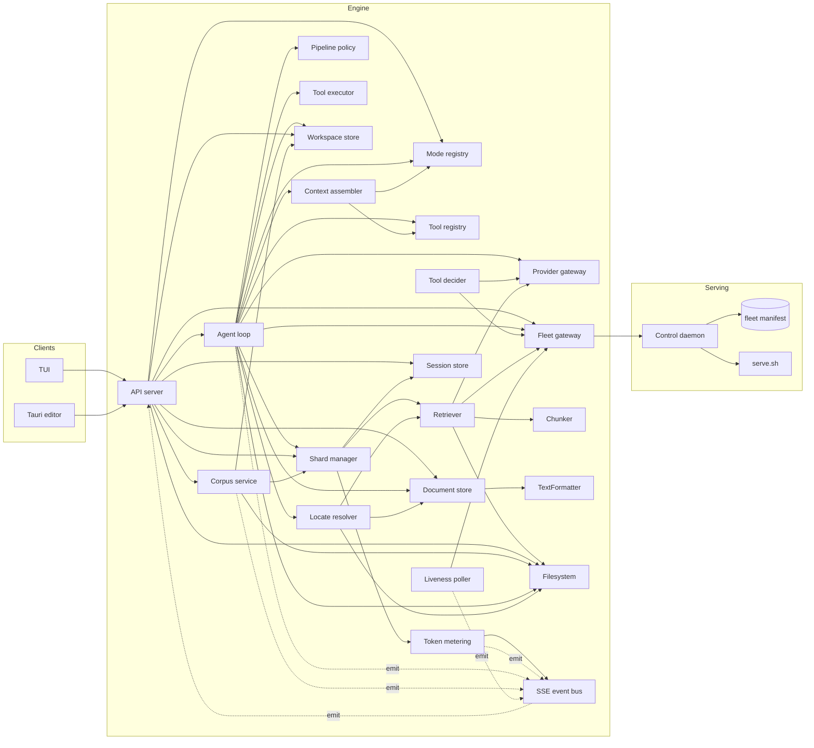

# Module boundaries contract

The per-system record of every module, its public API, and the dependency graph.
Normative per the base model (`ADR-0001`) — sealed-by-default modules exposing
only defined public APIs — hardened by the **locked-service tenet** (ADR-0016):
internal boundaries are sealed Go interfaces over **pure DTOs**, never REST.
REST/HTTP exists only at process boundaries.

Source ADRs: ADR-0001 (base model), ADR-0016 (module inventory + exact APIs),
ADR-0018 (two-tier fleet manifest), ADR-0019 (mode/tool data), ADR-0020 (storage),
ADR-0025 (control daemon), ADR-0026 (sessions), ADR-0035 (filesystem reach),
ADR-0044 (context engine), ADR-0047 (canonical paths), ADR-0049 (workspaces,
multi-root corpus, workspace-sharded context storage).

## 1. Modules

### Engine (Layer 2, Go)

| Module | Owns (concern) | Public API (defined operations) | Hidden internals |
|---|---|---|---|
| **Fleet gateway** | model discovery, resolution (merge + gates + fallback), lifecycle | `ListModels()`, `Resolve(name, opts) → Resolution`, `Status(name) → LiveState`, `ListStatus() → []ModelState` (batch `status/all`, ADR-0040), `Start(name)` (blocking), `Stop(name)`, `Provision(ctx, name) → provisionID`, `Fingerprint(name) → string` | daemon HTTP client (ADR-0025), verb mapping, fallback ladder |
| **Provider gateway** (leaf) | OpenAI-compatible REST/SSE calls | `Chat(ctx, target, req)`, `Stream(ctx, target, req, emit)`, `Embed(ctx, target, text)` | retry/backoff, per-server `-np 1` serialization, framing |
| **Agent loop** | the turn loop: task → plan → tools → observe → answer | `Run(ctx, task) → (turnID, err)` (async), `ResolveLocate(turnID, choice)` (ADR-0048 §4) | turn state machine, dispatch/observe, truncation, snapshot build/persist, `RouteTurn`, auto-RAG `rag` + `context` + `locate` events, `/locate` parse/anchor, in-memory picker registry |
| **Mode registry** (leaf) | prompt presets (name/systemPrompt/defaultModel) | `List()`, `Get(name)` | mode file loading (go:embed), validation |
| **Pipeline policy** (leaf) | the one global turn policy (step cap + budgets + auto-RAG top-k) | `Policy() → PipelinePolicy` | `config/pipeline.json` loading, schema validation |
| **Tool registry** (leaf) | tool definitions + JSON schemas (global) | `Register(tool)`, `List()` | schema validation, name-keyed binding metadata |
| **Tool executor** | tool execution | `Invoke(ctx, name, args) → result` (ctx carries the turn's shard services; ADR-0049 §5) | private `map[name]→handler func` |
| **Tool decider** (optional) | tool-intent resolution ("which tool, what args") from a writer's `request_tool` intent | `SignalTool()`, `Decide(ctx, intent, c) → (RouterResult, error)` | prompt layout, Provider.Chat, confidence threshold τ, `.cact` fingerprint |
| **Context assembler** (leaf) | the exact token payload + per-component attribution + per-message provenance/drops/budget | `Assemble(ctx, in) → (Payload, Breakdown)` | prompt layout, budget truncation, attribution accounting, provenance, labeled drops, budget utilization, front-loaded pinned chunks sharing the RAG budget |
| **Token metering** | counts + attribution + persistence + per-session aggregation | `Attribute(ctx, turnID, breakdown, counts) → Attributed`, `SessionUsage(ctx, sessionID)`, `SessionBreakdown(ctx, sessionID) → SessionMeter` | scale-to-total, per-workspace shard `meter.db` writes, thinking-token reconciliation (ADR-0024), per-component cumulative aggregate |
| **Retriever** | retrieval (hybrid semantic + lexical, provenance, eviction, status) + embedding-free FTS search for `/locate` | `Query(ctx, text, topK) → []Chunk`, `SearchText(ctx, query, limit) → []Chunk`, `Index(ctx, documentID)`, `IndexPath(ctx, path, hash)`, `Evict(ctx, ref)`, `Status() → []IndexedDocument`, `Get(ctx, refs) → []Chunk` | embedding (via Fleet+Provider), sqlite-vec KNN + FTS5 bm25 fused with RRF, sanitized FTS5 MATCH (no embed), per-workspace shard `index.db` |
| **Locate resolver** (sealed) | deterministic, token-free `/locate` chunk anchoring: normalize → exact → fuzzy over the open document then the workspace corpus index | `Resolve(ctx, {chunk, documentID}) → LocateResult` (ADR-0048) | markdown-strip/whitespace/case normalization, normalized-hash fast path, multi-block span windows, trigram/token Dice fuzzy (threshold 0.85), candidate ranking, staleness vs `Retriever.Status` + bounded disk read |
| **Chunker** (leaf) | chunking (heading-aware, paragraph-aligned, size-bounded) | `Chunk(tree []Block, maxTokens int) → ([]Chunk, error)`, `ChunkMarkdown(raw string, maxTokens int) → ([]Chunk, error)` | splitting algorithm |
| **TextFormatter** (leaf) | formatting: normalize + validate + format block content | `Normalize(kind, text)`, `Validate(kind, text)`, `Format(kind, text)` | hardcoded opinionated style, structural checks |
| **Document store** | document, blocks, version history | `Open`, `Save`, `Blocks`, `ApplyEdit`, `Commit`, `Diff`, `History`, `Candidates` | git (go-git), block-UUID minting, candidate side-table, word-diff |
| **Filesystem** (leaf) | read-only filesystem reach: shallow directory listing + bounded raw reads, bounded by `ALLOWED_ROOTS` | `List(ctx, dir) → []Entry`, `Read(ctx, path, maxBytes)`, `AllowedRoots()` | `os.ReadDir`/`os.ReadFile`, canonicalization, allowlist + typed refusal, byte caps (ADR-0035, ADR-0049 §6) |
| **Workspace store** (leaf) | the global workspace registry: workspace records, corpus roots/scope, index jobs, eviction tombstones, turn/session routing | `ResolveOrCreate`, `Get`, `List`, `FindContaining`, `Scope`, `SetScope`, job/tombstone/routing methods (interface.md §9c) | `workspaces.db` (global), canonical root keys, corpus glob persistence |
| **Shard manager** | per-workspace context-state lifecycle: lazy open + per-shard migrate + LRU close, reference-counted leases | `Services(ctx, workspaceID) → *Lease{Retriever, Sessions, Meter}` | `<data>/workspaces/<id>/{index.db,sessions.db,meter.db}`, LRU cap, lease refcounts |
| **Corpus service** | the index-only multi-root corpus: scope walk (globs, hidden excluded), reconcile/evict, per-document status, async jobs, lifecycle hook | `Get`, `SetScope`, `Index`, `Evict`, `NotifyChanged` (interface.md §9d) | glob walk through Filesystem, single-flight job runner, tombstones/errors via Workspace store, `DocHook` decorator |
| **Session store** (leaf) | sessions + their messages + persisted per-turn context snapshots + the session context policy | `ListByDocument`, `ListByWorkspace`, `Create`, `Resume`, `Append`, `History`, `SaveContext`, `TurnContext`, `SetContextPolicy`, `ContextPolicy` | per-workspace shard `sessions.db`, `turn_context` retention (100/session), `context_policy` column (validated opaque JSON, ADR-0049 §8) |
| **API server** | the versioned REST/SSE surface (codegen'd) | HTTP routes + SSE endpoints per the OpenAPI spec | framing, validation, turnID↔client correlation |
| **SSE event bus** | typed event fan-out | `Emit(event)`, `Subscribe(filter) → stream` | connection registry, bounded chans |
| **Liveness poller** | the engine-side fleet feed producer (ADR-0052 §4): polls the daemon's batch `status/all` projection and emits a `fleet` event on change | none exposed to other modules (started by the composition root) | interval ticker, last-projection change detection, outage folding (`control: unreachable`) |

### Serving (Layer 0, `macos-dev-config`)

| Module | Owns (concern) | Public API (defined operations) | Hidden internals |
|---|---|---|---|
| **Fleet manifest** (data) | what models *can* be served (two-tier: daemons + models) | manifest schema + `Read() → []Model` (validated by the shared loader) | file location, git-ignored local overrides |
| **Control daemon** | HTTP transport over the verb contract; **sole reader of the manifest** | daemon HTTP contract (`list/start/stop/status/log/reach/provision`) | mapping HTTP → `serve.sh`; verb execution; manifest parse + lanes + provision + live state. Authored **and built** in `macos-dev-config` at `cmd/fleetdaemon/` (ADR-0033); `texteditor` holds only a mirror of the contract |
| **Lifecycle executor** (`serve.sh`) | running/stopping model servers (runner logic) | verb contract (invoked by the daemon) | per-runner CLI flags, health checks, delegate wrappers; receives the parsed manifest from the daemon (ADR-0025/0027) as per-invocation env vars (`RUNNER`/`MODEL`/`HOST`/`PORT`/`SERVE_PORT_<NAME>`), does not parse `models.json` |
| **Always-on agents** (`launchd/`) | reboot-persistent serving | install/load a named agent | plist templating, `launchctl` load; one always-on daemon agent (KeepAlive); runners are on-demand, not agent-managed |
| **Tailscale ACL** | remote inference authorization | deny-by-default ACL matching `tag:inference-client` → `tag:inference-server` ports | tailnet tag assignment; projected from the manifest, reconciled at daemon startup |

### Clients (Layer 3)

| Module | Owns (concern) | Public API | Hidden internals |
|---|---|---|---|
| **TUI** (OpenTUI + Solid) | terminal rendering + commands | *none exposed to engine* — consumes the OpenAPI spec (Hey API + Zod) | panel layout, renderable wiring |
| **Tauri editor** (later) | native markdown editing | *none exposed to engine* — consumes the OpenAPI spec (openapi-to-rust) | CodeMirror integration, file I/O, popover UI |

Anything **not** listed in "Public API" is private and unreachable from other
modules. The Fleet gateway's only serving-side dependency is the **control daemon's
HTTP contract** (ADR-0025) — it reads the manifest *only* through the daemon,
never the file directly.

## 2. Dependency graph

```mermaid
flowchart LR
    subgraph clients[Clients]
        TUI[TUI]
        Tauri[Tauri editor]
    end
    subgraph engine[Engine]
        API[API server]
        Loop[Agent loop]
        Assembler[Context assembler]
        Mode[Mode registry]
        Pipeline[Pipeline policy]
        ToolReg[Tool registry]
        ToolExec[Tool executor]
        Decider[Tool decider]
        Prov[Provider gateway]
        Fleet[Fleet gateway]
        Meter[Token metering]
        Retriever[Retriever]
        Chunker[Chunker]
        TextFormatter[TextFormatter]
        Doc[Document store]
        Sess[Session store]
        FS[Filesystem]
        WStore[Workspace store]
        Shards[Shard manager]
        Corpus[Corpus service]
        Locate[Locate resolver]
        Bus[SSE event bus]
        Poller[Liveness poller]
    end
    subgraph serving[Serving]
        Daemon[Control daemon]
        Manifest[(fleet manifest)]
        Exec[serve.sh]
    end

    TUI --> API
    Tauri --> API
    API --> Loop
    API --> Doc
    API --> Mode
    API --> Fleet
    API --> Sess
    Loop --> Mode
    Loop --> Pipeline
    Loop --> ToolReg
    Loop --> ToolExec
    Loop --> Assembler
    Loop --> Prov
    Loop --> Fleet
    Loop --> Doc
    Loop --> WStore
    Loop --> Shards
    Shards --> Retriever
    Shards --> Sess
    Shards --> Meter
    Decider --> Fleet
    Decider --> Prov
    Assembler --> Mode
    Assembler --> ToolReg
    Retriever --> Fleet
    Retriever --> Prov
    Retriever --> Chunker
    Retriever --> FS
    Doc --> TextFormatter
    API --> FS
    API --> WStore
    API --> Shards
    API --> Corpus
    Corpus --> WStore
    Corpus --> FS
    Corpus --> Shards
    Loop --> FS
    Loop --> Locate
    Locate --> Doc
    Locate --> Retriever
    Locate --> FS
    Meter --> Bus
    Fleet --> Daemon
    Daemon --> Manifest
    Daemon --> Exec
    Bus -.emit.-> API
    Meter -.emit.-> Bus
    Loop -.emit.-> Bus
    Corpus -.emit.-> Bus
    Poller --> Fleet
    Poller -.emit.-> Bus
```

- Every edge targets a module's **public API**, never its internals.
- The graph is **acyclic**; direction is inward (clients → engine → serving-data).
- Leaf modules (no out-edges) hold pure/deterministic logic: `Mode registry`,
  `Pipeline policy`, `Tool registry`, `Context assembler`, `Chunker`,
  `TextFormatter`, `Session store`, `Filesystem`, `Workspace store`,
  `Provider gateway`, and the `Fleet manifest`.
- The `Retriever` is **not** a leaf (depends on Fleet + Provider for the embed
  call, on the Chunker, and on the Filesystem for bounded corpus reads) — a
  deliberate consequence of ADR-0016/ADR-0049.
- The `Shard manager` is the composition-level lifecycle owner for
  workspace-scoped service instances (ADR-0049 §5); it is the only module that
  opens/closes shard files.
- The `Tool decider` is **not** a leaf (depends on Fleet + Provider to serve the
  router call) — a Retriever-style consequence. It is **parked/unwired** by
  ADR-0045: no mode enables it; the loop no longer depends on it (its edges below
  are dormant).
- The `Document store` is **not** a leaf (depends on `TextFormatter` to normalize on
  `ApplyEdit` and format on `Commit`/`Save`) — a deliberate consequence of
  ADR-0029.
- The `Locate resolver` is **not** a leaf (depends on the Document store for the
  open document's blocks, the Retriever for the embedding-free corpus search and
  status, and the Filesystem for bounded staleness reads) — a deliberate
  consequence of ADR-0048. It calls **no** model and no embedding path.
- The `Liveness poller` depends on the Fleet gateway and emits `fleet` events to
  the bus; it is the one feed producer that is not a direct in-process emit
  (the control daemon is external with no webhook — ADR-0025, ADR-0052 §4).

## 3. Public API signatures

Precise Go signatures and pure-DTO type definitions live in
`contracts/interface.md`:

- **Fleet + Provider + Retriever + Assembler + Meter + Document store +
  Session store + Event bus + TextFormatter + Filesystem + Workspace store +
  Shard manager + Locate resolver** — exact Go interface signatures (ADR-0016,
  ADR-0026, ADR-0029, ADR-0035, ADR-0048, ADR-0049).
- **Serving lifecycle** — the verb contract (ADR-0007), now transported by the
  control daemon (ADR-0025).
- The **fleet manifest schema** (two-tier) — `contracts/data-model.md` §2
  (ADR-0018).

## 4. Invariants

- No cross-module dependency reaches outside a defined public API (R1–R3).
- Every boundary type is a **pure DTO** (no behavior, no pointers into another
  module's state, no embedding of another module's *live* types) — the
  locked-service tenet (ADR-0016). Composition of other pure DTOs is permitted;
  shared DTOs are owner-free and live in one neutral package (ADR-0027).
- **Stream seams (named exceptions, ADR-0027):** the event bus's
  `Subscribe(filter) → <-chan Event` returns a stream handle (not shared mutable
  state) and the Provider's `Stream(…, emit func(RawEvent))` passes a stream sink;
  both carry only pure-DTO payloads (`Event`, `RawEvent`, `Request`). No other
  boundary crosses a handle, channel, or callback.
- The dependency graph is acyclic (R4).
- Each public API is narrow and stable (R2) and contracted (R6).
- The engine depends on serving *only* through the Fleet gateway → control daemon
  HTTP contract (ADR-0025). It never reads `models.json` directly and never
  invokes `serve.sh` directly.
- The control daemon is the sole reader of `models.json`; `serve.sh` receives the
  parsed manifest from the daemon (ADR-0027, as per-invocation env vars per ADR-0032),
  and the engine reads neither.
- The control daemon's source and binary both live in `macos-dev-config`
  (`cmd/fleetdaemon/`, built to `bin/`) since ADR-0033; the daemon is the
  machine-local LLM control plane every app consumes. The two-repo boundary is a
  contract (`daemon-http.md` + the manifest schema — canonical in
  `macos-dev-config`, mirrored here), never shared source (ADR-0032/0033).
- The Provider, Context assembler, TextFormatter, Filesystem, Workspace store,
  and Mode/Tool registries are all pure leaves.
- One SQLite file per service *instance* (ADR-0016 as amended by ADR-0049 §5):
  document identity/git/worktree and `workspaces.db` are global; the Retriever,
  Session store, and Token meter each own a per-workspace shard file. No SQLite
  file is shared across modules; no cross-workspace aggregation exists.
