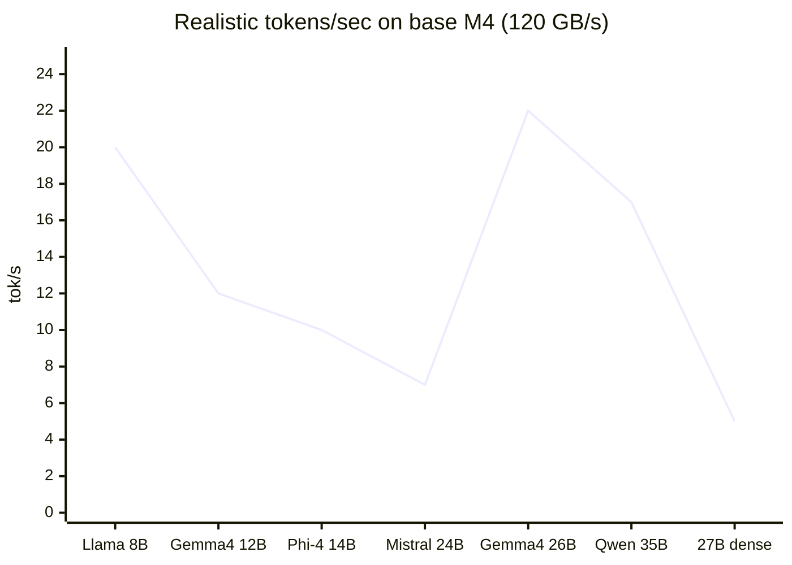

# Local LLMs for Academic Writing

Target hardware: **Mac Mini M4 (base), 32 GB unified memory, 120 GB/s bandwidth**.

Goal: fast, English-first models for academic writing and editing — *not* coding.
A dense 27B model is overkill here: it's memory-tight and bandwidth-bound (~5–6 tok/s) on this machine.

---

## Primary use case

- **Mostly editing text you've already written** — needs instruction following + preservation of your voice.
- **Sometimes writing new text from an existing source** — paraphrase, expand, or synthesize given material.
- **Context per session:** at most ~128K–180K tokens (a long chapter + edits), usually far less.

---

## What the "tok/s" figures mean (and why they're theoretical)

Token speed on Apple Silicon is **memory-bandwidth bound**, not compute bound. To generate each token the model must read its active weights from unified memory once, so there is a hard ceiling:

```
max tok/s ≈ memory bandwidth ÷ bytes read per token
```

The base M4 has **120 GB/s** of bandwidth. For a dense model, "bytes read per token" is just its file size:

- Gemma 4 12B at Q4 (~8 GB) → 120 ÷ 8 ≈ **15 tok/s max**.

MoE models break this rule: only ~3–4B params are active per token, so they read far fewer bytes than their file size suggests — which is why a 26B MoE can be *faster than a 14B dense model* despite being larger on disk.

Real throughput lands at roughly 60–80% of that ceiling (KV cache, context length, OS overhead), so the figures below are **estimates, not benchmarks**. Treat them as relative ("the MoE is ~3× faster than the dense 27B"), not absolute.

| Model | Quant | File size | Context | Realistic tok/s (base M4) |
| --- | --- | --- | --- | --- |
| Llama 3.1 8B | Q4_K_M | ~4.9 GB | 128K | ~18–22 |
| Gemma 4 12B | Q4_K_M | ~8 GB | 256K | ~11–13 |
| Phi-4 14B | Q4_K_M | ~9 GB | 16K ❌ | ~9–11 |
| Gemma 4 26B-A4B (MoE) | Q4 | ~15 GB | 256K | ~18–25 |
| Mistral Small 3.1 24B | Q4_K_M | ~14.5 GB | 128K | ~6–8 |
| Qwen 3.6-35B-A3B (MoE) | Q4 | ~20 GB | 262K | ~15–20 |
| Qwen 27B dense (current) | Q4 | ~17 GB | 128K | ~5–6 |



> Mermaid has no true scatter plot, so this uses a line chart (dots at each point). The x-axis is categorical — it cannot map two numeric variables, so "file size vs speed" can't be shown as a real x/y scatter here.

---

## What matters for academic work

Academic writing is not creative writing with footnotes. Four capabilities decide whether a model is usable:

1. **Instruction following at length** — holding a structure, section headers, and reference style across a full chapter.
2. **Citation discipline** — not inventing DOIs, page numbers, or author names when asked to use only sources provided in context.
3. **Long-context recall** — literature reviews need ≥32k tokens of source material in context.
4. **Domain knowledge ceiling** — how deep it can go before it becomes confidently wrong.

**Key rule:** 7–8B models fabricate citations at a high rate (>20% in one 2026 lit-review eval). Treat them as grammar passes only, never as drafters of citation-heavy text. 14B+ is the practical floor.

---

## Recommended picks (ranked for academic use)

### Editing — primary use

#### Gemma 4 12B — daily editing driver
- ~8 GB at Q4, ~11–13 tok/s, **256K context**, Apache 2.0.
- Native `system` prompt support; strong instruction following for applying edits while preserving your voice.

**Pros**

- 256K context — comfortably holds a full chapter plus your edits.
- Apache 2.0 license (cleaner than Gemma 3's restrictive Terms of Use).
- Fast and interactive for multi-pass editing.

**Cons**

- 12B ceiling limits depth on long, complex sections.
- Mid-tier prose "voice" — great for editing, not the most expressive drafter.

#### Gemma 4 26B-A4B (MoE) — higher-quality editing + writing from source
- ~15 GB at Q4, ~18–25 tok/s, **256K context**, Apache 2.0.
- 26B total / ~4B active per token; long-context recall jumped from ~13% (Gemma 3) to ~66% (Gemma 4) on RULER 128K.

**Pros**

- Long-document retrieval is dramatically better than the previous generation — important for chapter-length edits.
- MoE speed: near-27B quality at small-model token speed.
- Fits 32 GB with real headroom for context.

**Cons**

- Multimodal-vision training adds overhead you don't need for text editing.
- Less "creative voice" than Mistral — best as an editor/synthesizer, not a fiction drafter.

### Writing from source / prose — secondary use

#### Mistral Small 3.1 24B — best English prose (128K)
- ~14–18 GB at Q4/Q5, ~6–8 tok/s, 128K context, Apache 2.0.
- Community consensus for English prose in its size class — writing-focused reviews (not standard benchmarks) consistently rank it the best writer under ~16 GB. Standard benchmarks don't capture prose quality, so verify on your own prompts. (Llama 3.3 70B is the overall prose champion, but needs ~40 GB.)

**Pros**

- Natural register, strong tone/style instruction following, less formulaic "AI-sounding" output.
- Lower fabricated-citation rate than 14B-class models.
- Apache 2.0 license.

**Cons**

- Slowest of the picks on base M4 — usable, but not snappy.
- 128K context (vs 256K on the Gemma 4 picks).

#### Qwen 3.6-35B-A3B (MoE) — max quality, still fast
- ~20 GB at Q4, ~15–20 tok/s, 262K context, only 3B active per token.
- Multilingual-tuned but writes excellent English; the "27B quality at small-model speed" option.

**Pros**

- Near-27B writing quality with small-model token speed.
- Handles long-form and complex documents well.
- Native 262K context.

**Cons**

- ~20 GB file leaves the least headroom for long context on 32 GB.
- MoE variants can lag on brand-new tooling support.
- Multilingual-focused training (still fine for English).

> **Note on Mistral MoE:** Mistral *does* make MoE models — Mixtral 8x7B / 8x22B (deprecated), Mistral Large 3 (675B / 41B active), and Mistral Small 4 (119B / 6.5B active) — but none fit a 32 GB Mac. The 24B "Small" that fits is dense.

### Special roles

#### Phi-4 14B (`microsoft/phi-4`) — short-pass polishing only
- ~9 GB at Q4, ~9–11 tok/s, **16K context ❌**.
- Best instruction-following for editing and rewrites — but its 16K window can't hold a long document, so use it only for paragraph- and section-length passes.

**Pros:** excellent edit-while-preserving-voice; strong structure/outline control; fast.

**Cons:** 16K context is a hard limit for your use case; highest citation-hallucination rate of the 14B+ picks.

#### Llama 3.1 8B Instruct — grammar pass only
- ~5 GB at Q4, ~18–22 tok/s, 128K context.

**Pros:** very fast; mature ecosystem; reliable low-temperature proofreading.

**Cons:** **do not use for citation-heavy drafting** — high fabrication rate at this size.

---

## Bottom line

- **Editing (primary):** Gemma 4 12B for speed, or Gemma 4 26B-A4B for more quality — both 256K.
- **Writing from source / prose:** Mistral Small 3.1 24B (best voice) or the Qwen 35B-A3B MoE (max quality).
- **Short-pass polish only:** Phi-4 14B (16K limit).
- **Grammar pass:** Llama 3.1 8B.
- **One-model compromise:** Gemma 4 26B-A4B — 256K context, MoE speed, near-27B quality, fits comfortably.

---

## Academic workflow rules

- **Always pass sources in context.** Never ask a local model to "find papers on X" — that is the failure mode behind fake-citation scandals. Pipe PDFs through a retrieval layer instead.
- **Use this system-prompt line:** *"Use only sources provided. If unsure, write '[citation needed]'. APA 7 or Chicago author-date, as specified."* This alone roughly halves fabricated citations.
- **Separate drafting and reviewing.** Don't let the model that wrote a paragraph judge whether it's correct.
- **Don't trust statistics it generates.** Numbers and direct quotes get re-extracted by hand.

---

## Temperature cheat sheet

| Task | Temperature |
| --- | --- |
| Editing / proofreading | 0.3–0.4 |
| Drafting sections | 0.4–0.6 |
| Brainstorming / outlining | 0.6–0.7 |

> Keep temperature low for academic work — lower values reduce hallucination and keep citations faithful to the provided sources.
